# AWS Cloud Club IITU CDK Workshop

This repository represents AWS Cloud Development Kit (CDK) Immersion Day Workshop to run in your own AWS account. The workshop is organized by [AWS Cloud Club at IITU in Almaty, Kazakhstan](https://www.meetup.com/aws-cloud-club-at-iitu/).

## Workshop Overview

> [!CAUTION]   
> Running this workshop in your AWS Account will inccure some costs for you.   
> After finishig the workshop, don't forget to delete all created resources with `cdk destroy --all`   

The given workshop shows how to develop CDK code in TypeScript to deploy AWS infrastructure components. Including:
- [CDK Default Sample App deployment with SQS and SNS](https://github.com/Brain2life/iitu-cdk-workshop/tree/4fff4672272f6b2e2108e7e1d8886c0b32d6e6bf) - git commit `4fff467`
- [Deploying AWS Lambda Function](https://github.com/Brain2life/iitu-cdk-workshop/tree/138fb38a08bf52f398aa92d4afc51eaf14fd0ab5) - git commit `138fb38`

## Materials

- [AWS CDK Immersion Day Workshop](https://catalog.workshops.aws/workshops/10141411-0192-4021-afa8-2436f3c66bd8/en-US)

## Workshop Prerequisites

In order to run the workshop, first make sure that you have installed and configured the following packages:
1. [AWS Account with Adminstrator User](https://catalog.workshops.aws/workshops/10141411-0192-4021-afa8-2436f3c66bd8/en-US/20-prerequisites/40-account)
2. [AWS CLI](https://docs.aws.amazon.com/cli/latest/userguide/getting-started-install.html) configured with your AWS account credentials via `aws configure`
3. [NodeJS 22.x or later](https://nodejs.org/en/download/) 
4. TypeScript 3.8 or later
```bash
npm install -g typescript
```
5. Install AWS CDK Toolkit:
```bash
npm install -g aws-cdk
```
To check the installation, run:
```bash
cdk --version
```

For more information, see [AWS CDK prerequisites](https://docs.aws.amazon.com/cdk/v2/guide/prerequisites.html).

## Initial setup

1. Create separate folder for your CDK project that will hold all of your infrastructure code:
```bash
mkdir cdk-workshop && cd cdk-workshop
```
2. To create a new TypeScript CDK Project run:
```bash
cdk init sample-app --language typescript
```
`sample-app` is the name of your CDK project app. You can choose your own CDK app name as you wish.

During app initialization you should see the following message:
```bash
# Welcome to your CDK TypeScript project

You should explore the contents of this project. It demonstrates a CDK app with an instance of a stack (`CdkWorkshopStack`)
which contains an Amazon SQS queue that is subscribed to an Amazon SNS topic.

The `cdk.json` file tells the CDK Toolkit how to execute your app.

## Useful commands

* `npm run build`   compile typescript to js
* `npm run watch`   watch for changes and compile
* `npm run test`    perform the jest unit tests
* `cdk deploy`      deploy this stack to your default AWS account/region
* `cdk diff`        compare deployed stack with current state
* `cdk synth`       emits the synthesized CloudFormation template
```

As info message says, by default CDK creates an example CDK stack that [**deploys Amazon SQS queue subscribed to SNS topic**](https://docs.aws.amazon.com/sns/latest/dg/subscribe-sqs-queue-to-sns-topic.html). This is a classic example of a **"fanout" architecture**, allowing messages published to a single SNS topic to be delivered to multiple, independent queues for asynchronous processing. In a few lines of code you provision the following architecture without worrying about deploying and configuration of the underlying components and IAM roles and permissions:

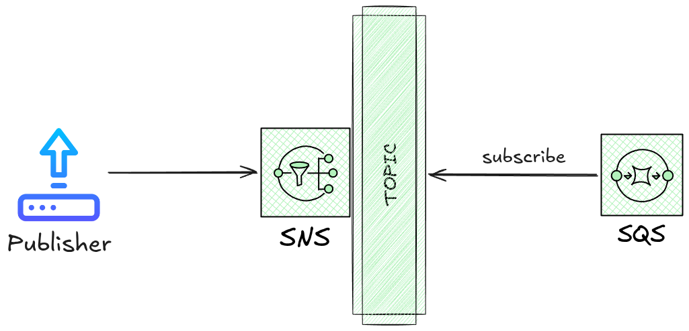

The main code that defines this stack is in `lib/cdk-workshop-stack.ts`:

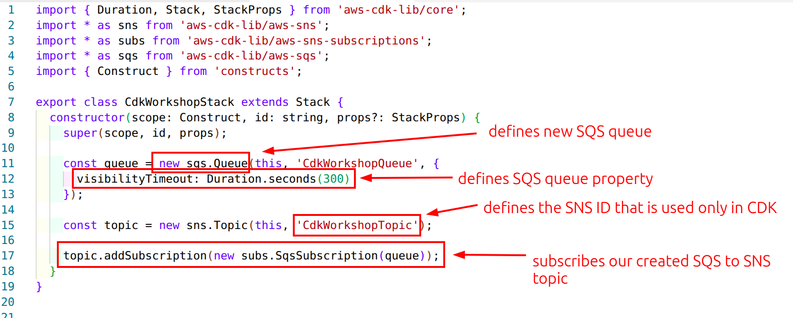

## CDK Project Structure

The created sample app project structure looks like this:
```bash
cdk-workshop/                 # Root directory of the CDK app
├── bin/
│   └── cdk-workshop.ts       # The execution entry point script for the CDK app
├── lib/                      # Contains the stack definitions (infrastructure code)
│   └── cdk-workshop-stack.ts # Stack definition that defines infrastructure components (SNS and SQS)
├── test/                     # Contains unit tests for the stacks
├── .gitignore                # Specifies files/folders to ignore in Git
├── .npmignore                # Specifies files and directories to exclude when publishing the project as an npm package
├── cdk.json                  # Configuration file for the CDK app
├── jest.config.js            # Configuration for Jest (testing framework)
├── package.json              # Node.js package configuration (dependencies, scripts)
├── package-lock.json         # Lockfile for exact dependency versions (if using npm)
├── README.md                 # Project documentation and setup instructions
├── tsconfig.json             # TypeScript configuration file
```

## CDK Basic Commands

`[STACKS..]` - optional parameter for the names of stacks. For example the name of our initialized CDK stack is `CdkWorkshopStack`.

1. To get help:
```bash
cdk help
```
2. To list all stacks in the app:
```bash
cdk list --all
cdk list [STACKS..]
```
3. To print the CloudFormation YAML template file:
```bash
cdk synthesize [STACKS..]
```
4. To initialize your CDK to work with your AWS account and specific region:
```bash
cdk bootstrap [ENVIRONMENTS..]
```
5. To deploy stack into AWS account:
```bash
cdk deploy [STACKs..]
```
6. To monitor code changes in live deployment:
```bash
cdk watch [STACKS..]
```
7. To delete created stack(s):
```bash
cdk destroy [STACKS..]
```
8. To create a new, empty CDK project from a template:
```bash
cdk init [TEMPLATE_NAME] --language [PROGRAMMING_LANGUAGE]
```

## How CDK works?

CDK code compiles into CloudFormation YAML/JSON template files. Next, CloudFormation deploys the compiled files into AWS.

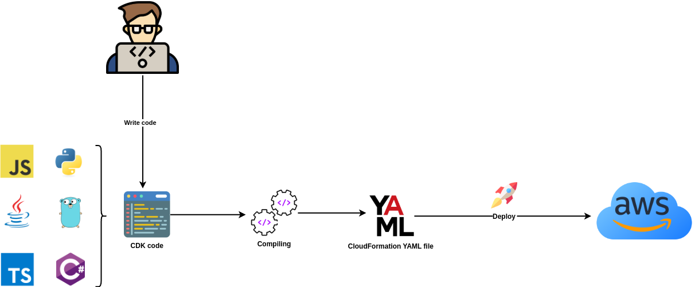

To synthesize AWS CloudFormation template file from your CDK code, go to the root of your project and run:
```bash
cdk synth
```

In the CLI output you should see the CloudFormation Template that will be deployed into AWS:
```yaml
esources:
  CdkWorkshopQueue50D9D426:
    Type: AWS::SQS::Queue
    Properties:
      VisibilityTimeout: 300
    UpdateReplacePolicy: Delete
    DeletionPolicy: Delete
    Metadata:
      aws:cdk:path: CdkWorkshopStack/CdkWorkshopQueue/Resource
  CdkWorkshopQueuePolicyAF2494A5:
    Type: AWS::SQS::QueuePolicy
    Properties:
      PolicyDocument:
        Statement:
          - Action: sqs:SendMessage
            Condition:
              ArnEquals:
                aws:SourceArn:
                  Ref: CdkWorkshopTopicD368A42F
            Effect: Allow
            Principal:
              Service: sns.amazonaws.com
            Resource:
              Fn::GetAtt:
                - CdkWorkshopQueue50D9D426
                - Arn
        Version: "2012-10-17"
      Queues:
        - Ref: CdkWorkshopQueue50D9D426
    Metadata:
      aws:cdk:path: CdkWorkshopStack/CdkWorkshopQueue/Policy/Resource
  CdkWorkshopQueueCdkWorkshopStackCdkWorkshopTopicD7BE96438B5AD106:
    Type: AWS::SNS::Subscription
    Properties:
      Protocol: sqs
      TopicArn:
        Ref: CdkWorkshopTopicD368A42F
      Endpoint:
        Fn::GetAtt:
          - CdkWorkshopQueue50D9D426
          - Arn
    DependsOn:
      - CdkWorkshopQueuePolicyAF2494A5
    Metadata:
      aws:cdk:path: CdkWorkshopStack/CdkWorkshopQueue/CdkWorkshopStackCdkWorkshopTopicD7BE9643/Resource
  CdkWorkshopTopicD368A42F:
    Type: AWS::SNS::Topic
    Metadata:
      aws:cdk:path: CdkWorkshopStack/CdkWorkshopTopic/Resource
  CDKMetadata:
    Type: AWS::CDK::Metadata
    Properties:
      Analytics: v2:deflate64:H4sIAAAAAAAA/1WO0QrCMAxFv8X3NjpBwef9gG6+y9ZWyDab2bSKlP676wqCL8m5hwvJHg4n2G26N0ulRzlhD7H1nRrFom6RnwzxEkwwor7bAus804Tq85MlJsF26behZ+Vw9kg2N/7ylWZU2a6QUsbGMAWn1hs1WY25mYQlbWDg7as6QpW/HBhRumA9Pgw0ZX8B5//lbcEAAAA=
    Metadata:
      aws:cdk:path: CdkWorkshopStack/CDKMetadata/Default
    Condition: CDKMetadataAvailable
Conditions:
  CDKMetadataAvailable:
    Fn::Or:
      - Fn::Or:
          - Fn::Equals:
              - Ref: AWS::Region
              - af-south-1
          - Fn::Equals:
              - Ref: AWS::Region
              - ap-east-1
          - Fn::Equals:
              - Ref: AWS::Region
              - ap-northeast-1
          - Fn::Equals:
              - Ref: AWS::Region
              - ap-northeast-2
          - Fn::Equals:
              - Ref: AWS::Region
              - ap-south-1
          - Fn::Equals:
              - Ref: AWS::Region
              - ap-southeast-1
          - Fn::Equals:
              - Ref: AWS::Region
              - ap-southeast-2
          - Fn::Equals:
              - Ref: AWS::Region
              - ca-central-1
          - Fn::Equals:
              - Ref: AWS::Region
              - cn-north-1
          - Fn::Equals:
              - Ref: AWS::Region
              - cn-northwest-1
      - Fn::Or:
          - Fn::Equals:
              - Ref: AWS::Region
              - eu-central-1
          - Fn::Equals:
              - Ref: AWS::Region
              - eu-north-1
          - Fn::Equals:
              - Ref: AWS::Region
              - eu-south-1
          - Fn::Equals:
              - Ref: AWS::Region
              - eu-west-1
          - Fn::Equals:
              - Ref: AWS::Region
              - eu-west-2
          - Fn::Equals:
              - Ref: AWS::Region
              - eu-west-3
          - Fn::Equals:
              - Ref: AWS::Region
              - me-south-1
          - Fn::Equals:
              - Ref: AWS::Region
              - sa-east-1
          - Fn::Equals:
              - Ref: AWS::Region
              - us-east-1
          - Fn::Equals:
              - Ref: AWS::Region
              - us-east-2
      - Fn::Or:
          - Fn::Equals:
              - Ref: AWS::Region
              - us-west-1
          - Fn::Equals:
              - Ref: AWS::Region
              - us-west-2
Parameters:
  BootstrapVersion:
    Type: AWS::SSM::Parameter::Value<String>
    Default: /cdk-bootstrap/hnb659fds/version
    Description: Version of the CDK Bootstrap resources in this environment, automatically retrieved from SSM Parameter Store. [cdk:skip]
```

You can use this command to inspect your infrastructure changes before deploying them into AWS Cloud. For convenience save the output into separate file for inspection:
```bash
cdk synth > cdk_cfn_output.yaml
```

## Bootstrapping an Environment

Before deploying any resources into AWS Cloud with CDK, first you have to prepare the [**bootstrap environment**](https://docs.aws.amazon.com/cdk/v2/guide/bootstrapping.html) for CDK. This environment is comprised of foundational AWS components required for CDK functioning:
- **S3 bucket** to store CloudFormation Templates
- **AWS ECR Registry** to store Docker container images
- **IAM Roles and policies** for CDK to execute deployments in your AWS account

To install the bootstrap stack run the following command:
```bash
cdk bootstrap
```

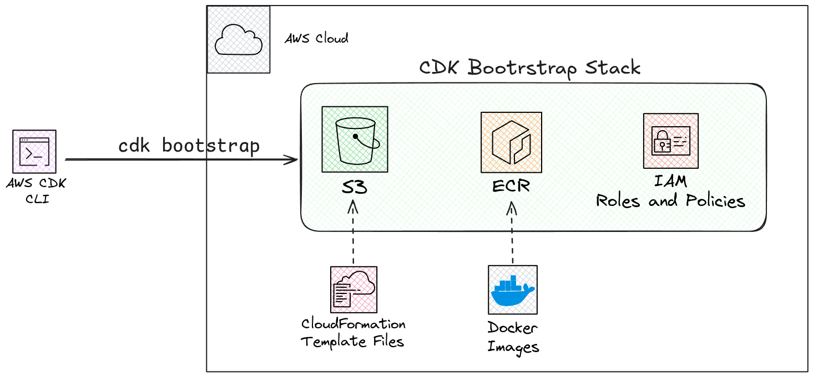

> [!CAUTION]   
> Running `cdk bootstrap` command will use your **AWS CLI's default profile credentials**.     
> If you need to specify specific AWS region or AWS CLI profile for use, you have to define them in `/bin/cdk-workshop.ts` entry execution file  

Unfortunately, **CDK for now doesn't have a dedicated command to delete CDK boostrap stack, so you have to manually delete all the created resources in your AWS Console**. For S3 bucket make sure first to empty it and then try to delete it.

## Deploying CDK Default Sample App

After bootstrapping the CDK environment, we can now deploy our default CDK app with this single command:
```bash
cdk deploy
```

This will provisions SQS and SNS in our AWS account.

On your first run of the command you can see the alert message that shows what changes CDK is planning to do in your account and asks for your approval:
```bash
This deployment will make potentially sensitive changes according to your current security approval level (--require-approval broadening).
Please confirm you intend to make the following modifications:

IAM Statement Changes
┌───┬────────────────────────────────┬────────┬─────────────────┬────────────────────────────────┬────────────────────────────────┐
│   │ Resource                       │ Effect │ Action          │ Principal                      │ Condition                      │
├───┼────────────────────────────────┼────────┼─────────────────┼────────────────────────────────┼────────────────────────────────┤
│ + │ ${CdkWorkshopQueue.Arn}        │ Allow  │ sqs:SendMessage │ Service:sns.amazonaws.com      │ "ArnEquals": {                 │
│   │                                │        │                 │                                │   "aws:SourceArn": "${CdkWorks │
│   │                                │        │                 │                                │ hopTopic}"                     │
│   │                                │        │                 │                                │ }                              │
└───┴────────────────────────────────┴────────┴─────────────────┴────────────────────────────────┴────────────────────────────────┘
(NOTE: There may be security-related changes not in this list. See https://github.com/aws/aws-cdk/issues/1299)

Do you wish to deploy these changes (y/n)?
```

You can inspect your deployed stack and resources in AWS CloudFormation Console:

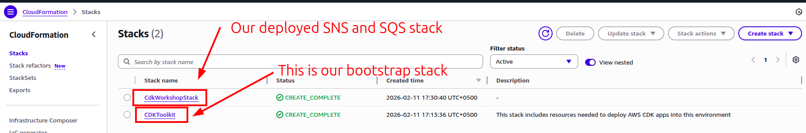

From `CdWorkshopStack` you can find our deployed resources:

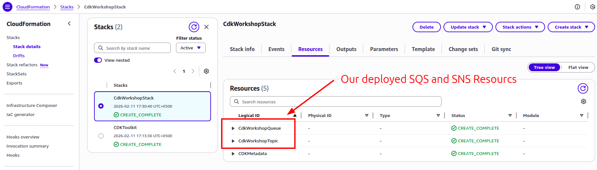

If you need to delete all stack and it's resources, then run:
```bash
cdk destroy
```

## Cleanup Sample App Code

To clean up the code and see how CDK will handle it in action, delete the SQS and SNS definitions from `lib/cdk-workshop-stack.ts` file:
```typescript
import { Stack, StackProps } from 'aws-cdk-lib/core';
import { Construct } from 'constructs';

export class CdkWorkshopStack extends Stack {
  constructor(scope: Construct, id: string, props?: StackProps) {
    super(scope, id, props);

    // Nothing to see here, move along
  }
}
```

### `cdk diff`

Now that we modified our stack's contents, we can ask the toolkit to show us the difference between our CDK app and what's currently deployed. This is a safe way to check what will happen once we run `cdk deploy` and is always a good practice:
```bash
cdk diff
```

In the CLI output you should what kind of actions CDK is going to do in your AWS account:
```bash
start: Building CdkWorkshopStack Template
success: Built CdkWorkshopStack Template
start: Publishing CdkWorkshopStack Template (current_account-current_region-5eb34042)
success: Published CdkWorkshopStack Template (current_account-current_region-5eb34042)
Hold on while we create a read-only change set to get a diff with accurate replacement information (use --no-change-set to use a less accurate but faster template-only diff)

Stack CdkWorkshopStack
IAM Statement Changes
┌───┬─────────────────────────────────┬────────┬─────────────────┬───────────────────────────┬──────────────────────────────────────────────────┐
│   │ Resource                        │ Effect │ Action          │ Principal                 │ Condition                                        │
├───┼─────────────────────────────────┼────────┼─────────────────┼───────────────────────────┼──────────────────────────────────────────────────┤
│ - │ ${CdkWorkshopQueue50D9D426.Arn} │ Allow  │ sqs:SendMessage │ Service:sns.amazonaws.com │ "ArnEquals": {                                   │
│   │                                 │        │                 │                           │   "aws:SourceArn": "${CdkWorkshopTopicD368A42F}" │
│   │                                 │        │                 │                           │ }                                                │
└───┴─────────────────────────────────┴────────┴─────────────────┴───────────────────────────┴──────────────────────────────────────────────────┘
(NOTE: There may be security-related changes not in this list. See https://github.com/aws/aws-cdk/issues/1299)

Resources
[-] AWS::SQS::Queue CdkWorkshopQueue50D9D426 destroy
[-] AWS::SQS::QueuePolicy CdkWorkshopQueuePolicyAF2494A5 destroy
[-] AWS::SNS::Topic CdkWorkshopTopicD368A42F destroy
[-] AWS::SNS::Subscription CdkWorkshopTopicCdkWorkshopQueueSubscription88D211C7 destroy
```

Deploy the changes to delete the SQS and SNS stack components from your AWS account:
```bash
cdk deploy
```

## New Sample App with Lambda and API Gateway

In this part, we will write CDK code to deploy **AWS Lambda function** and **API Gateway** in front of it to **expose a public URL endpoint**. Users will be able to hit any URL in the endpoint and they'll receive a heartwarming greeting from Lambda function.

See the following scheme:

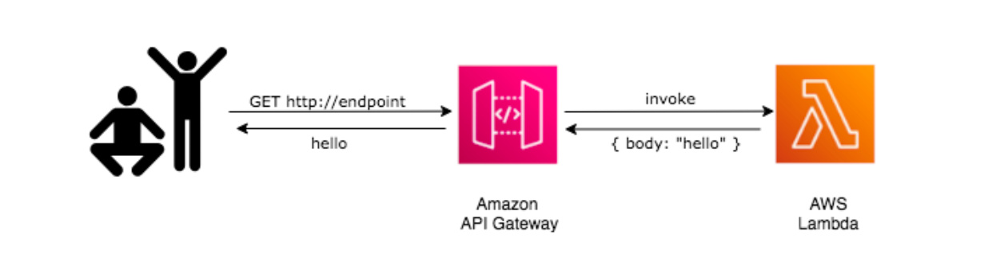

### Lambda Handler Code

In AWS Lambda, the [**handler**](https://docs.aws.amazon.com/lambda/latest/dg/typescript-handler.html) is the specific method or function in your code that acts as the entry point for execution. When your Lambda function is triggered — whether by an API request, a file upload, or a timer — the runtime environment calls this specific function to begin processing the event.

The handler typically processes two main inputs:

* **Event:** A JSON-formatted document containing data from the triggering source (like the details of an HTTP request).
* **Context:** An object that provides information about the invocation, function configuration, and execution environment.

Think of it like the `main()` function in traditional programming, but specifically designed to wake up, do its job, and shut down once the event is handled.

For more information, see [Decoding Lambda Handler Architecture: How AWS Lambda Functions Work](https://medium.com/@vigneshdayalan/decoding-lambda-handler-architecture-how-aws-lambda-functions-work-f9fd71ee75df).

Now let's write our handler code for API requests:
1. First, in the root of your project create a `lambda` directory:
```bash
cd cdk-workshop
mkdir lambda
```

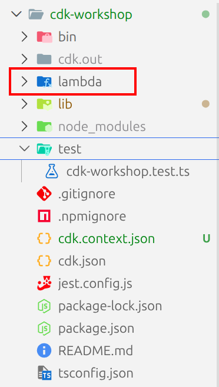

2. Next, we need to edit our `.gitignore` file and add `!lambda/*.js` to ensure that Git tracks all JS files in our newly created `lambda` directory:
```bash
*.js
!lambda/*.js # Allow JavaScript files in the lambda directory
!jest.config.js
*.d.ts
node_modules

# CDK asset staging directory
.cdk.staging
cdk.out
```

3. In `lambda` directory create `hello.js` file and add the following code:
```javascript
exports.handler = async function (event, context) {
  console.log('Remaining time:', context.getRemainingTimeInMillis()); // Accessing the `context` object properties
  console.log('request:', JSON.stringify(event, undefined, 2)); // Printing the details of the incoming request
  
  return {
    statusCode: 200,
    headers: { 'Content-Type': 'text/plain' },
    body: `Hello, CDK! You've hit ${event.path}\n`,
  };
}
```

This is a simple Lambda function which returns the text **"Hello, CDK! You've hit [url path]"**. The function's output also includes the HTTP status code and HTTP headers. These are used by API Gateway to formulate the HTTP response to the user.

### AWS Lambda Construct Library

The AWS CDK is shipped with an extensive library of constructs called the **AWS Construct Library**. The construct library is divided into **modules**, one for each AWS service. For example, if you want to define an AWS Lambda function, we will need to use the AWS Lambda construct library.

To learn more, browse the [AWS Construct Library](https://docs.aws.amazon.com/cdk/api/v2/docs/aws-construct-library.html).

In the AWS CDK, the **Construct Library** is organized like a set of building blocks, moving from raw cloud resources to complex, pre-packaged architectures.

### CDK Modules (`aws-cdk-lib`)

In CDK v2, the library is centralized into a single package called [`aws-cdk-lib`](https://docs.aws.amazon.com/cdk/api/v2/docs/aws-cdk-lib-readme.html). This package is divided into **modules** based on AWS services.

Each module follows a naming convention like `aws_s3`, `aws_lambda`, or `aws_iam`. When you need to create a bucket, you import from the S3 module:

```typescript
import { aws_s3 as s3 } from 'aws-cdk-lib';
```

### The Hierarchy of Constructs (L1, L2, L3)

The core of the library is the [**Construct**](https://docs.aws.amazon.com/cdk/v2/guide/constructs.html), which is the basic unit of a CDK app. These are organized into three **"Levels" of abstraction**, often visualized as a pyramid where higher levels provide more convenience and lower levels provide more control.

| Level | Name | Description | Example |
| --- | --- | --- | --- |
| **L1** | **CFN Resources** | Low-level, 1-to-1 mapping to CloudFormation. Names always start with `Cfn`. | `CfnBucket` |
| **L2** | **Curated Constructs** | Higher-level "intent-based" APIs with sensible defaults and helper methods (like `.grantRead()`). | `Bucket` |
| **L3** | **Patterns** | High-level "opinionated" combinations of multiple resources designed for a specific task. | `ApplicationLoadBalancedFargateService` |

* **L1 (Low-level):** Use these when a new AWS feature isn't yet supported by higher levels. You have to define every single property manually.
* **L2 (Recommended):** These are what you'll use 90% of the time. They handle security best practices and "boilerplate" glue logic for you.
* **L3 (Patterns):** These are "architectures in a box." For example, an L3 pattern for a web server might create an ECS Cluster, a Load Balancer, and the necessary IAM roles all in one command.

### The Composition Hierarchy

Beyond the abstraction levels, CDK code is organized in a physical tree structure called the **Construct Tree**. This hierarchy dictates how resources are grouped and named.

1. **App:** The root of your entire CDK project. It can contain one or more Stacks.
2. **Stack:** The unit of deployment. Everything in a single Stack is deployed as one CloudFormation stack.
3. **Construct:** Inside a Stack, you define your resources (L1, L2, or L3).
4. **Resource:** The actual AWS component (e.g., an S3 Bucket or an EC2 Instance) that ends up in your account.

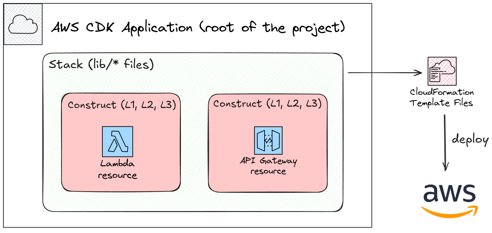

For more information, see [The difference between a Stack and Construct in AWS CDK](https://stackoverflow.com/questions/67855703/the-difference-between-a-stack-and-construct-in-aws-cdk)

## Adding AWS Lambda Function

Now we can add our AWS Lambda function code definition that will process our incoming requests. Add the following code into `lib/cdk-workshop-stack.ts` file:
```typescript
// Import the core building blocks from the AWS CDK library
import { Stack, StackProps } from "aws-cdk-lib"; 
// Import specific classes needed to define a Lambda function
import { Code, Function, Runtime } from "aws-cdk-lib/aws-lambda";
// Import the base 'Construct' class (all CDK components are Constructs)
import { Construct } from "constructs";

// Define a new class that represents our CloudFormation Stack
export class CdkWorkshopStack extends Stack {
  
  // The constructor is where we define our resources
  // 'scope' is the parent (usually the App), 'id' is a unique name for this stack
  constructor(scope: Construct, id: string, props?: StackProps) {
    // Call the parent 'Stack' constructor to initialize the stack
    super(scope, id, props);

    /**
     * Define an AWS Lambda Resource (an L2 Construct)
     * 'this' refers to this stack (the scope)
     * 'HelloHandler' is the logical ID inside CloudFormation
     */
    const hello = new Function(this, "HelloHandler", {
      
      // 1. Specifies the engine: Node.js version 22
      runtime: Runtime.NODEJS_22_X, 
      
      // 2. Tells CDK where the actual code sits on your computer. 
      // It will zip up everything inside the "lambda" folder and upload it.
      code: Code.fromAsset("lambda"), 
      
      // 3. The 'entry point' in your code. 
      // "hello.handler" means: Look in 'hello.js' for a function named 'handler'.
      handler: "hello.handler", 
    });
  }
}
```

## Class Signature in CDK Constructs

In the AWS CDK, every single resource (from a simple S3 bucket to a massive VPC) is a **Construct**. To create these resources, the constructor always requires three specific arguments: `scope`, `id`, and `props`.

Think of this signature as the **"Address and Identity"** system for your infrastructure.

### 1. `scope` (The "Parent")

The `scope` defines **where** this construct lives in the hierarchy.

* In 99% of cases, you pass `this`, which tells the CDK: "This resource belongs to the current Stack or Class I am writing."
* **Why we need it:** It allows the CDK to build a **Tree Structure**. This hierarchy is used to generate unique names for your resources in AWS (e.g., `MyStack-MyLambda-1A2B3C`).

### 2. `id` (The "Local Name")

The `id` is a string that must be **unique within its scope**.

* If you have two Lambda functions in the same stack, they cannot both be named `"MyFunction"`.
* **Why we need it:** This is the "Logical ID" in CloudFormation. It allows the CDK to track the resource. If you change the `id`, CDK will think you deleted the old resource and created a new one.

### 3. `props` (The "Configuration")

The `props` (Properties) is an object that defines **how** the resource should behave.

* For a Lambda, this includes the `runtime`, `memory`, and `handler`.
* **Why we need it:** It’s the "settings menu." Without it, every resource would just be a generic, empty shell with no specific configuration.

### Why is this pattern used everywhere?

This consistent signature enables **Composition**. Because every construct looks the same at the top level, you can nest them infinitely.

For example, you can create a custom construct called `SecureBucket` that contains an S3 bucket and an IAM policy. Because your `SecureBucket` also uses `(scope, id, props)`, it can be used by others just as easily as a standard AWS resource.

```typescript
import { Construct } from 'constructs';
import { aws_s3 as s3 } from 'aws-cdk-lib';

export class SecureBucket extends Construct {
  constructor(scope: Construct, id: string) {
    // 1. We pass the scope and id to the base 'Construct' class
    super(scope, id);

    // 2. We define a real S3 Bucket INSIDE this custom construct
    // Notice we use 'this' as the scope, so the bucket belongs to SecureBucket
    new s3.Bucket(this, 'InternalBucket', {
      encryption: s3.BucketEncryption.S3_MANAGED, // Forced encryption
      enforceSSL: true,                           // Forced SSL
      versioned: true,                            // Forced versioning
      blockPublicAccess: s3.BlockPublicAccess.BLOCK_ALL, // No public access
    });
  }
}
```
Now, instead of writing 10 lines of security settings every time you need a bucket, you just do this in your main **Stack**:
```typescript
// In your main stack:
new SecureBucket(this, 'MyFirstSafeBucket');
new SecureBucket(this, 'MySecondSafeBucket');
```

## Deploying our Lambda Function

To deploy our new Lambda function, first review the changes and then deploy:
```bash
cdk diff
cdk deploy
```

To test our function, go to [AWS Lambda Console](https://console.aws.amazon.com/lambda/home#/functions) and from the **Test** tab under the **Function overview pane** create a new test event:

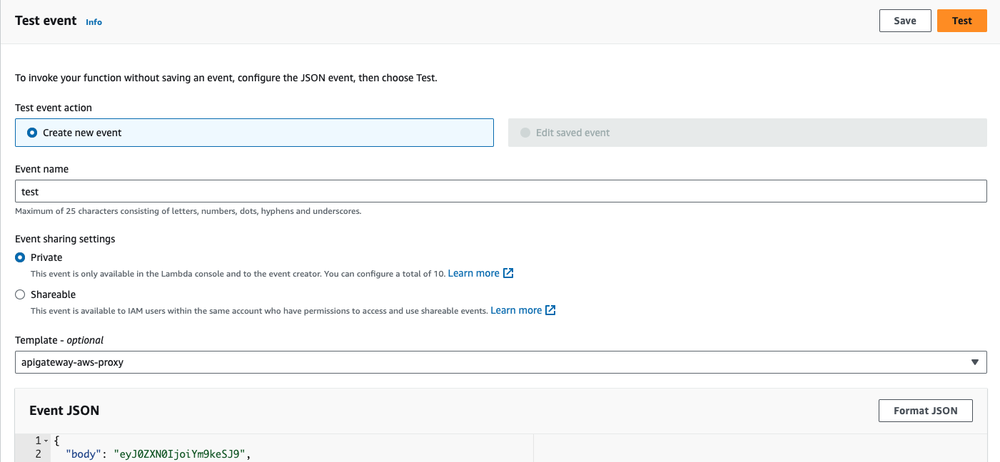

Hit **Test** button and wait for the execution to complete.

In the output you should see the details of the request and the context object's remaining time property value:

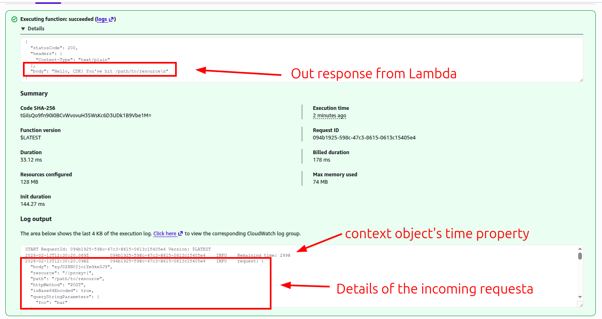